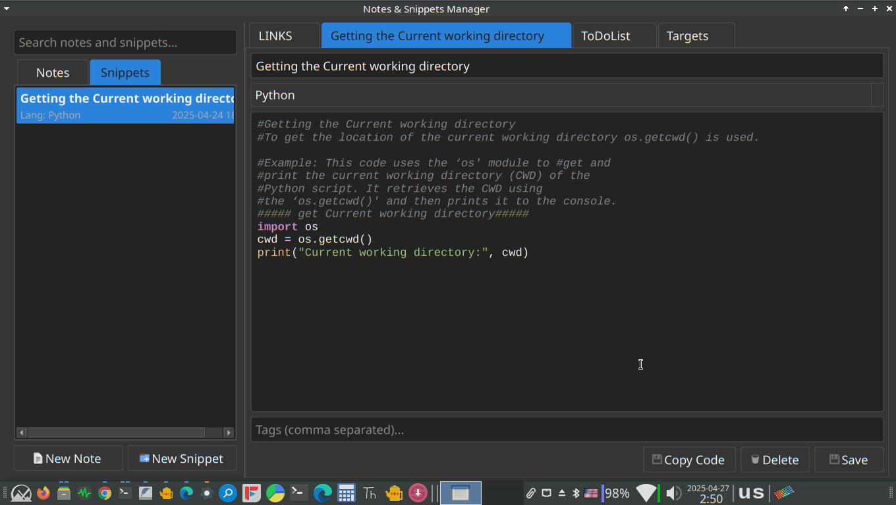

---

**File: `README.md`**

```markdown
# Notes & Snippets Manager

A desktop application built with Python and PyQt6 for managing personal notes and code snippets efficiently.

 <!-- Add a screenshot later -->

## Features

*   **Dual Management:** Manage both rich-text notes and code snippets in separate sections.
*   **Rich Text Notes:**
    *   WYSIWYG editor with standard formatting options (bold, italic, underline, alignment).
    *   Font family, size, and color selection.
    *   Automatic link detection and activation (clickable URLs and email addresses).
*   **Code Snippets:**
    *   Syntax highlighting for various languages (Python, JS, HTML, CSS, SQL, Java, C++, C#, PHP, Ruby, Go, Text).
    *   Language selection dropdown.
    *   "Copy Code" button for easy clipboard access.
*   **Organization:**
    *   Assign titles and tags (comma-separated) to notes and snippets.
    *   Lists are sorted by last modified/created time.
*   **Search:** Quickly search through titles, content/code, and tags of both notes and snippets.
*   **Tabbed Interface:** Open multiple notes and snippets in separate editor tabs.
*   **Asynchronous Database:** Uses background threads for database operations (adding, saving, deleting, loading, searching) to keep the UI responsive.
*   **Dirty State Indication:** Tabs with unsaved changes are marked with an asterisk (*).
*   **Save Prompts:** Prompts to save changes when closing a modified tab or the application.
*   **Dark Theme:** Includes a modern dark theme for comfortable viewing (can be customized in `utils/style.py`).
*   **Keyboard Shortcuts:** Common actions are accessible via keyboard shortcuts (e.g., Ctrl+S to Save, Ctrl+N for New Note, Ctrl+K to Insert Link).

## Requirements

*   Python 3.x (tested with 3.10+)
*   PyQt6 (`pip install PyQt6`)

## Installation & Setup

1.  **Clone the repository:**
    ```bash
    git clone <your-repository-url>
    cd notes-manager-project # Or your project directory name
    ```
2.  **Install dependencies:**
    ```bash
    pip install PyQt6
    ```
    *(No other external libraries are required by the core application as presented).*
3.  **Create Icons Folder:** Create a directory named `icons` in the project's root directory (next to `main.py`). Place the required icon files (see "Icons" section below) in this folder.
4.  **Database:** The SQLite database file (`database/notes.db`) will be created automatically in the `database` subfolder when you first run the application.

## Usage

Run the main application script:

```bash
python main.py
```

Or use the provided shell script (if applicable):

```bash
./notes_manager.sh
```

*   Use the "Notes" and "Snippets" tabs on the left to view your items.
*   Click "New Note" or "New Snippet" to create new items.
*   Click or double-click an item in the list to open it in an editor tab.
*   Use the search bar to filter items.
*   Use the formatting toolbar in the Note editor.
*   Use the language selector and "Copy Code" button in the Snippet editor.
*   Save changes using the "Save" button (Ctrl+S).
*   Delete items using the "Delete" button (Ctrl+Delete).
*   Insert/edit links in notes using Ctrl+K or the dedicated toolbar button.
*   Close tabs using the 'x' button or Ctrl+W.

## Icons

The application looks for the following `.png` icon files inside the `icons/` directory. Please provide these icons for the best user experience. Standard fallback icons will be used if files are missing.

*   `new_note.png`
*   `new_snippet.png`
*   `save.png`
*   `delete.png`
*   `copy.png` (for Snippet Editor)
*   `bold.png`
*   `italic.png`
*   `underline.png`
*   `align_left.png`
*   `align_center.png`
*   `align_right.png`
*   `color.png`
*   `links.png` (for Note Editor's Insert/Edit Link button)

## Code Structure

*   `main.py`: Entry point of the application. Initializes QApplication, DataManager, and MainWindow.
*   `ui/`: Contains UI related files.
    *   `main_window.py`: Defines the main application window layout, lists, tabs, and signal handling between UI elements and DataManager.
    *   `base_editor.py`: Abstract base class for Note and Snippet editors, handling common elements like title, tags, save/delete buttons, dirty state, and communication signals.
    *   `note_editor.py`: Rich text editor widget for notes, inheriting from BaseEditor. Includes formatting toolbar and link handling.
    *   `snippet_editor.py`: Editor widget for code snippets, inheriting from BaseEditor. Includes language selection, syntax highlighting, and copy button.
    *   `syntax_highlighter.py`: Implements syntax highlighting logic for different languages using QSyntaxHighlighter.
*   `database/`: Contains database interaction files.
    *   `data_manager.py`: Manages all database operations (CRUD, search) asynchronously using a thread pool (DBWorker). Connects DB operations to UI signals.
    *   `db_handler.py`: Manages the SQLite database connection and initialization.
    *   `db_worker.py`: QRunnable class that executes database functions in background threads.
    *   `models.py`: Defines data classes (dataclasses) for `Note`, `Snippet`, and `RecentItem`.
*   `widgets/`: Contains custom list item widgets.
    *   `note_item.py`: Custom widget for displaying notes in the QListWidget.
    *   `snippet_item.py`: Custom widget for displaying snippets in the QListWidget.
*   `utils/`: Contains utility files.
    *   `style.py`: Defines the dark theme stylesheet and palette loading function.
*   `icons/`: (To be created by user) Directory to store icon `.png` files.

## Contributing

Contributions are welcome! Please feel free to submit pull requests or open issues for bugs or feature suggestions.

## License

(Specify your license here, e.g., MIT License, GPLv3, etc.)

```

---

**File: `userguide.html`**

```html
<!DOCTYPE html>
<html lang="en">
<head>
    <meta charset="UTF-8">
    <meta name="viewport" content="width=device-width, initial-scale=1.0">
    <title>Notes & Snippets Manager - User Guide</title>
    <style>
        body {
            font-family: sans-serif;
            line-height: 1.6;
            margin: 20px;
            max-width: 800px;
            margin-left: auto;
            margin-right: auto;
            background-color: #f8f8f8;
            color: #333;
        }
        h1, h2, h3 {
            color: #0056b3; /* Blue headings */
            border-bottom: 1px solid #ccc;
            padding-bottom: 5px;
        }
        code {
            background-color: #e8e8e8;
            padding: 2px 5px;
            border-radius: 3px;
            font-family: monospace;
        }
        kbd {
            background-color: #eee;
            border-radius: 3px;
            border: 1px solid #b4b4b4;
            box-shadow: 0 1px 1px rgba(0, 0, 0, .2), 0 2px 0 0 rgba(255, 255, 255, .7) inset;
            color: #333;
            display: inline-block;
            font-size: .85em;
            font-weight: 700;
            line-height: 1;
            padding: 2px 4px;
            white-space: nowrap;
        }
        .container {
            background-color: #fff;
            padding: 20px 30px;
            border-radius: 5px;
            box-shadow: 0 2px 5px rgba(0,0,0,0.1);
        }
        .toc ul {
            list-style: none;
            padding: 0;
        }
        .toc li {
            margin-bottom: 5px;
        }
        .toc a {
            text-decoration: none;
            color: #0056b3;
        }
        .toc a:hover {
            text-decoration: underline;
        }
    </style>
</head>
<body>
    <div class="container">
        <h1>Notes & Snippets Manager - User Guide</h1>

        <nav class="toc">
            <h2>Table of Contents</h2>
            <ul>
                <li><a href="#introduction">1. Introduction</a></li>
                <li><a href="#interface">2. Interface Overview</a></li>
                <li><a href="#managing-notes">3. Managing Notes</a>
                    <ul>
                        <li><a href="#creating-notes">3.1 Creating/Editing Notes</a></li>
                        <li><a href="#formatting-notes">3.2 Formatting Notes</a></li>
                        <li><a href="#working-with-links">3.3 Working with Links</a></li>
                    </ul>
                </li>
                <li><a href="#managing-snippets">4. Managing Snippets</a>
                    <ul>
                        <li><a href="#creating-snippets">4.1 Creating/Editing Snippets</a></li>
                        <li><a href="#syntax-highlighting">4.2 Syntax Highlighting</a></li>
                        <li><a href="#copying-code">4.3 Copying Code</a></li>
                    </ul>
                </li>
                <li><a href="#common-features">5. Common Features</a>
                    <ul>
                        <li><a href="#titles-tags">5.1 Titles and Tags</a></li>
                        <li><a href="#saving-deleting">5.2 Saving and Deleting</a></li>
                        <li><a href="#searching">5.3 Searching</a></li>
                        <li><a href="#tabs">5.4 Working with Tabs</a></li>
                    </ul>
                </li>
                 <li><a href="#shortcuts">6. Keyboard Shortcuts</a></li>
            </ul>
        </nav>

        <section id="introduction">
            <h2>1. Introduction</h2>
            <p>Welcome to the Notes & Snippets Manager! This application helps you organize your thoughts, ideas, and useful code snippets in one place. It features a rich text editor for notes and a code editor with syntax highlighting for snippets.</p>
        </section>

        <section id="interface">
            <h2>2. Interface Overview</h2>
            <p>The main window is divided into two main sections:</p>
            <ul>
                <li><strong>Sidebar (Left):</strong> Contains the search bar, tabs for "Notes" and "Snippets" lists, and buttons to create new items.</li>
                <li><strong>Content Area (Right):</strong> This is where editor tabs for individual notes and snippets are opened.</li>
            </ul>
            <p>The status bar at the bottom may display error messages related to database operations.</p>
        </section>

        <section id="managing-notes">
            <h2>3. Managing Notes</h2>
            <p>Use the "Notes" tab in the sidebar to manage your rich-text notes.</p>

            <h3 id="creating-notes">3.1 Creating/Editing Notes</h3>
            <ul>
                <li><strong>Create:** Click the "New Note" button (<kbd>Ctrl</kbd>+<kbd>N</kbd>) to open a new, empty note editor tab.</li>
                <li><strong>Open:** Click or double-click a note in the list to open it in an editor tab.</li>
                <li><strong>Title:** Enter a title for your note in the top input field.</li>
                <li><strong>Content:** Write your note content in the main editor area below the formatting toolbar.</li>
            </ul>

            <h3 id="formatting-notes">3.2 Formatting Notes</h3>
            <p>The toolbar above the note content area provides standard formatting options:</p>
            <ul>
                <li><strong>Basic Styles:** Bold (<kbd>Ctrl</kbd>+<kbd>B</kbd>), Italic (<kbd>Ctrl</kbd>+<kbd>I</kbd>), Underline (<kbd>Ctrl</kbd>+<kbd>U</kbd>). These are toggle buttons.</li>
                <li><strong>Alignment:** Align Left (<kbd>Ctrl</kbd>+<kbd>L</kbd>), Align Center (<kbd>Ctrl</kbd>+<kbd>E</kbd>), Align Right (<kbd>Ctrl</kbd>+<kbd>R</kbd>). Only one can be active at a time for the current paragraph.</li>
                <li><strong>Font:** Select a font family and size using the dropdown and spin box.</li>
                <li><strong>Color:** Click the color button to choose a text color.</li>
            </ul>
            <p>Formatting applies to selected text or the text you type after changing the format.</p>

             <h3 id="working-with-links">3.3 Working with Links</h3>
             <ul>
                 <li><strong>Creating/Editing Links:**
                     <ul>
                        <li>Select the text you want to turn into a link (or place the cursor where you want to insert a new link).</li>
                        <li>Click the "Insert/Edit Link" button (icon looks like chain links, <kbd>Ctrl</kbd>+<kbd>K</kbd>) on the toolbar.</li>
                        <li>A dialog will appear. Enter the "Display Text" and the "Link URL" (e.g., <code>https://www.example.com</code> or <code>mailto:user@example.com</code>).</li>
                        <li>If you selected an existing link created this way, the dialog will be pre-filled, allowing you to edit or remove the link.</li>
                     </ul>
                 </li>
                 <li><strong>Clicking Links:** Click on a link (text that is typically blue and underlined) to open it in your default web browser or email client.</li>
                 <li><strong>Note:** Links must be created using the "Insert/Edit Link" button to be reliably clickable. Plain text URLs or links from older versions might not be interactive.</li>
             </ul>
        </section>

        <section id="managing-snippets">
            <h2>4. Managing Snippets</h2>
            <p>Use the "Snippets" tab in the sidebar to manage your code snippets.</p>

            <h3 id="creating-snippets">4.1 Creating/Editing Snippets</h3>
             <ul>
                <li><strong>Create:** Click the "New Snippet" button (<kbd>Ctrl</kbd>+<kbd>Shift</kbd>+<kbd>N</kbd>) to open a new, empty snippet editor tab.</li>
                <li><strong>Open:** Click or double-click a snippet in the list to open it in an editor tab.</li>
                <li><strong>Title:** Enter a title for your snippet in the top input field.</li>
                <li><strong>Code:** Enter or paste your code into the main editor area.</li>
            </ul>

            <h3 id="syntax-highlighting">4.2 Syntax Highlighting</h3>
            <ul>
                <li>Select the appropriate programming language from the dropdown menu above the code editor.</li>
                <li>Syntax highlighting will be applied automatically based on the selected language. Supported languages include Python, JavaScript, HTML, CSS, SQL, Java, C++, C#, PHP, Ruby, Go, and plain Text.</li>
            </ul>

            <h3 id="copying-code">4.3 Copying Code</h3>
            <ul>
                <li>Click the "Copy Code" button (<kbd>Ctrl</kbd>+<kbd>Shift</kbd>+<kbd>C</kbd>) located in the button row below the editor to copy the entire code snippet to your system clipboard.</li>
            </ul>
        </section>

        <section id="common-features">
            <h2>5. Common Features</h2>

            <h3 id="titles-tags">5.1 Titles and Tags</h3>
            <ul>
                <li>Both notes and snippets require a title or content/code to be saved.</li>
                <li>You can add comma-separated tags in the "Tags" input field below the main content area to categorize your items (e.g., <code>python, database, example</code>). Tags are included in searches.</li>
            </ul>

            <h3 id="saving-deleting">5.2 Saving and Deleting</h3>
            <ul>
                <li><strong>Saving:** Click the "Save" button (<kbd>Ctrl</kbd>+<kbd>S</kbd>) to save the current note or snippet. New items will be added to the list, and existing items will be updated. The asterisk (*) in the tab title will disappear upon successful save.</li>
                <li><strong>Deleting:** Click the "Delete" button (<kbd>Ctrl</kbd>+<kbd>Delete</kbd>) to permanently delete the currently open note or snippet. You will be asked for confirmation. The "Delete" button is only visible for saved items.</li>
            </ul>

            <h3 id="searching">5.3 Searching</h3>
             <ul>
                <li>Type your search query into the search bar at the top of the sidebar.</li>
                <li>The application will search in real-time through the titles, content/code, and tags of both notes and snippets.</li>
                <li>The lists will update automatically to show matching results.</li>
                <li>Clear the search bar to show all items again.</li>
            </ul>

             <h3 id="tabs">5.4 Working with Tabs</h3>
            <ul>
                <li>Each opened note or snippet appears in its own tab in the content area.</li>
                <li>Tabs with unsaved changes will have an asterisk (*) next to their title.</li>
                <li>Close a tab by clicking the 'x' button on the tab or by pressing <kbd>Ctrl</kbd>+<kbd>W</kbd>.</li>
                <li>If a tab has unsaved changes, you will be prompted to Save, Discard, or Cancel before closing.</li>
                <li>When closing the main application window, you will be prompted similarly for any open tabs with unsaved changes.</li>
            </ul>
        </section>

        <section id="shortcuts">
            <h2>6. Keyboard Shortcuts</h2>
            <ul>
                <li><kbd>Ctrl</kbd>+<kbd>N</kbd>: New Note</li>
                <li><kbd>Ctrl</kbd>+<kbd>Shift</kbd>+<kbd>N</kbd>: New Snippet</li>
                <li><kbd>Ctrl</kbd>+<kbd>S</kbd>: Save current note/snippet</li>
                <li><kbd>Ctrl</kbd>+<kbd>Delete</kbd>: Delete current note/snippet</li>
                <li><kbd>Ctrl</kbd>+<kbd>W</kbd>: Close current tab</li>
                <li><kbd>Ctrl</kbd>+<kbd>B</kbd>: Toggle Bold (Note Editor)</li>
                <li><kbd>Ctrl</kbd>+<kbd>I</kbd>: Toggle Italic (Note Editor)</li>
                <li><kbd>Ctrl</kbd>+<kbd>U</kbd>: Toggle Underline (Note Editor)</li>
                <li><kbd>Ctrl</kbd>+<kbd>L</kbd>: Align Left (Note Editor)</li>
                <li><kbd>Ctrl</kbd>+<kbd>E</kbd>: Align Center (Note Editor)</li>
                <li><kbd>Ctrl</kbd>+<kbd>R</kbd>: Align Right (Note Editor)</li>
                <li><kbd>Ctrl</kbd>+<kbd>K</kbd>: Insert/Edit Link (Note Editor)</li>
                <li><kbd>Ctrl</kbd>+<kbd>Shift</kbd>+<kbd>C</kbd>: Copy Code (Snippet Editor)</li>
            </ul>
        </section>

        <hr>
        <p><em>Thank you for using the Notes & Snippets Manager!</em></p>
    </div>
</body>
</html>
```

**Notes:**

*   **README Screenshot:** Remember to replace `placeholder.png` in the `README.md` with an actual screenshot of your application once you have one.
*   **License:** Fill in the license information in the `README.md`.
*   **HTML Structure:** The `userguide.html` uses basic HTML and CSS for structure and readability. You can customize the CSS further if desired.
*   **Completeness:** These documents reflect the features implemented based on our discussion. If you add more features later, remember to update these guides.
