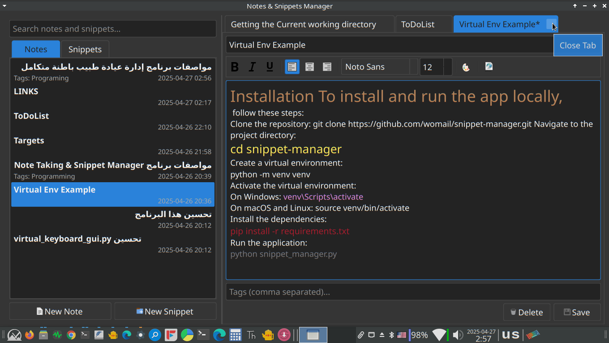

# Notes & Snippets Manager

A desktop application built with Python and PyQt6 for managing personal notes and code snippets efficiently.

 <!-- Add a screenshot later -->

## Features

*   **Dual Management:** Manage both rich-text notes and code snippets in separate sections.
*   **Rich Text Notes:**
    *   WYSIWYG editor with standard formatting options (bold, italic, underline, alignment).
    *   Font family, size, and color selection.
    *   Automatic link detection and activation (clickable URLs and email addresses).
*   **Code Snippets:**
    *   Syntax highlighting for various languages (Python, JS, HTML, CSS, SQL, Java, C++, C#, PHP, Ruby, Go, Text).
    *   Language selection dropdown.
    *   "Copy Code" button for easy clipboard access.

*   **Organization:**
    *   Assign titles and tags (comma-separated) to notes and snippets.
    *   Lists are sorted by last modified/created time.
*   **Search:** Quickly search through titles, content/code, and tags of both notes and snippets.
*   **Tabbed Interface:** Open multiple notes and snippets in separate editor tabs.
*   **Asynchronous Database:** Uses background threads for database operations (adding, saving, deleting, loading, searching) to keep the UI responsive.
*   **Dirty State Indication:** Tabs with unsaved changes are marked with an asterisk (*).
*   **Save Prompts:** Prompts to save changes when closing a modified tab or the application.
*   **Dark Theme:** Includes a modern dark theme for comfortable viewing (can be customized in `utils/style.py`).
*   **Keyboard Shortcuts:** Common actions are accessible via keyboard shortcuts (e.g., Ctrl+S to Save, Ctrl+N for New Note, Ctrl+K to Insert Link).

## Requirements

*   Python 3.x (tested with 3.10+)
*   PyQt6 (`pip install PyQt6`)

## Installation & Setup

1.  **Clone the repository:**
    ```bash
    git clone <your-repository-url>
    cd notes-manager-project # Or your project directory name
    ```
2.  **Install dependencies:**
    ```bash
    pip install PyQt6
    ```
    *(No other external libraries are required by the core application as presented).*
3.  **Create Icons Folder:** Create a directory named `icons` in the project's root directory (next to `main.py`). Place the required icon files (see "Icons" section below) in this folder.
4.  **Database:** The SQLite database file (`database/notes.db`) will be created automatically in the `database` subfolder when you first run the application.

## Usage

* Run the main application script:
* ./notes_manager.sh
OR
* python main.py